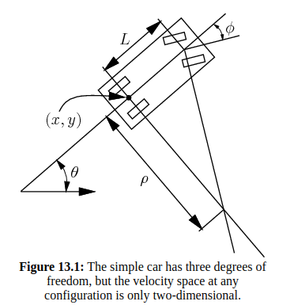
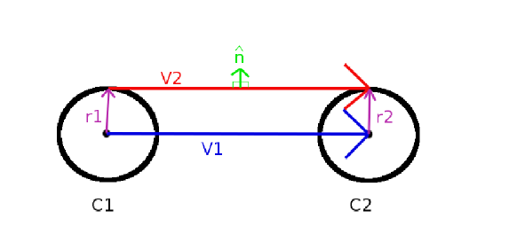
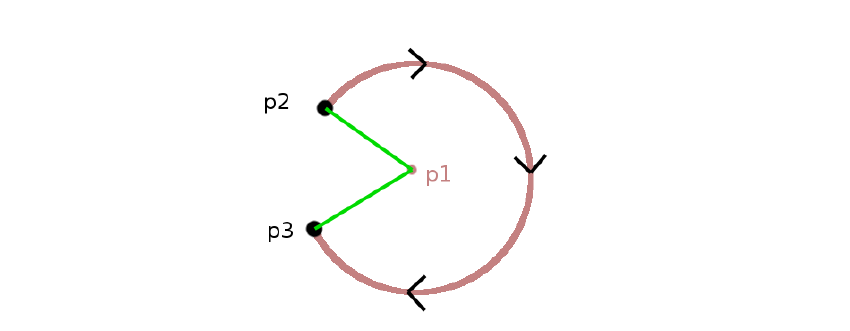
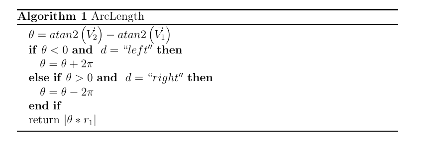
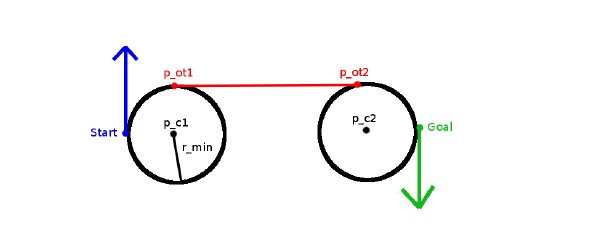
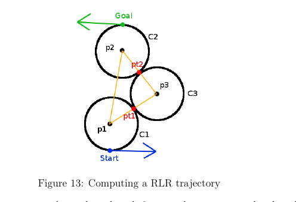
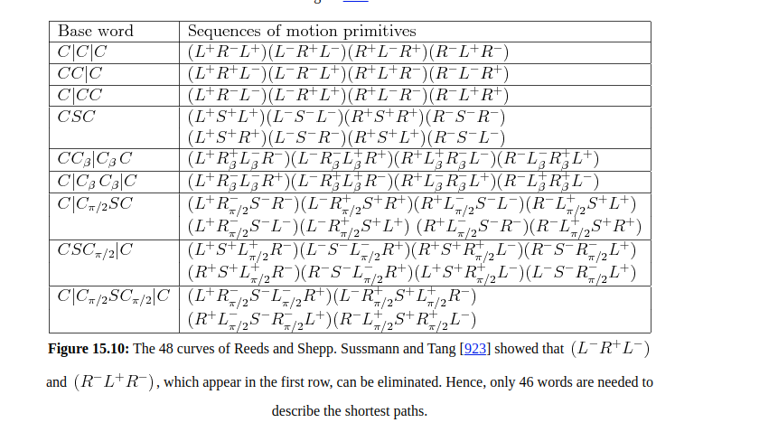
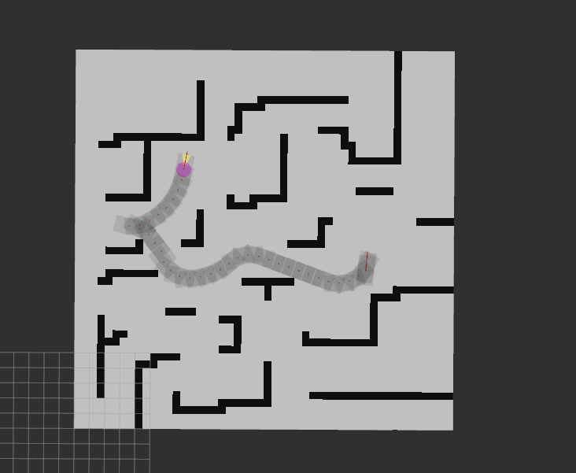
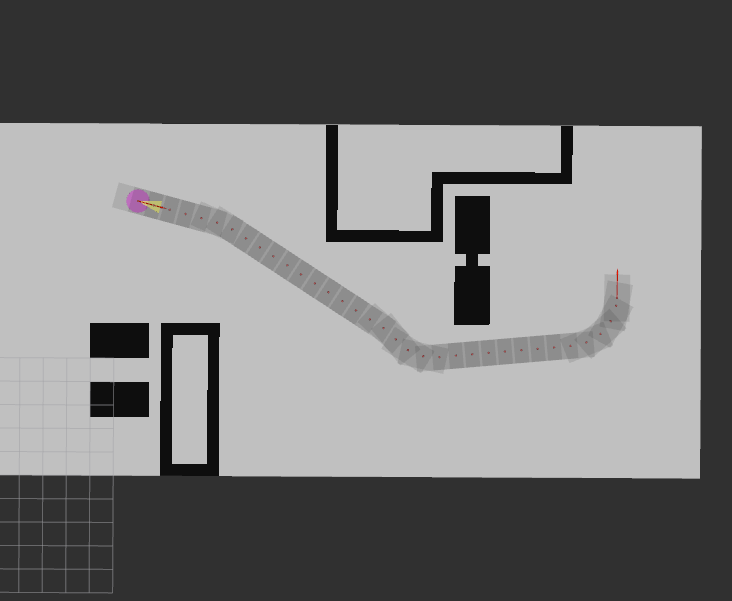

# hybrid-a-star

## 依赖

- Ubuntu 18.04
- ROS Melodic

## Ros Graph

## 车辆模型:

$(x,y)$: 车辆定位位置，在后轴中心处

$\theta$: 车辆的朝向

$L$:  轴距

$\rho$:  转弯半径

$$
\begin{bmatrix}
\dot{x} \\
\dot{y} \\
\dot{\theta}
\end{bmatrix} =
v \begin{bmatrix}
\cos\theta \\
\sin\theta \\
\frac{\tan{\phi}}{L}
\end{bmatrix}
$$

更新方程:

$$
\begin{bmatrix}
x_{k+1} \\
y_{k+1} \\
\theta_{k+1}
\end{bmatrix}
=
\begin{bmatrix}
x_k + \Delta s\cos\theta \\
y_k + \Delta s\sin\theta \\
\theta_k + \frac{\Delta s}{L} * \tan\phi_k
\end{bmatrix}
$$

$\Delta s = v\Delta t$:  机器人运动距离,

## Dubin Curve

假设车辆的起点为 $q_I$, 终点为$q_F$,  那么求解最短路径可以写成求解如下优化问题：
$$
\min L(q,u) = \min \int_0^{t_F} \sqrt{\dot{x}(t)^2 + \dot{y}(t)^2} \text{d}t
$$
假设车辆运行速度恒定，那么，（3）式中的代价函数 $L(q, u)$ 只与 $t_F$ 相关。

已经证明，给定任意的起点和终点，Dubin car的最短路径总是可以表示为不超过三种的motion primitives.

Dubin car 的action 只有 $u\in\{-1, 0, 1\}$. 并且可以证明，只有六种motion primitives 是最优的。
$$
\{L_\alpha R_\beta L_\gamma, R_\alpha L_\beta R_\gamma,L_\alpha S_d L_\gamma,L_\alpha S_dR_\gamma,R_\alpha S_d L_\gamma,R_\alpha S_d R_\gamma\}
$$
其中 $\alpha\in [0, 2\pi), \gamma \in [0, 2\pi), \beta \in (\pi, 2\pi), d \geq 0$.

### 向量法计算切线

1. 给定两个圆$C_1, C_2$, 圆心分别是$p_1, p_2$;

2. 连接$p_1, p_2$, 构造向量$\vec{V_1}$, 向量的模长为$D$;

3. 绘制两个圆的公切线, 如上图所示为$\vec{V_2} = p_{\text{opt}2} - p_{\text{opt}1}$.

4. 绘制$\vec{V_2}$ 的法向量，$\hat{n}$, 为单位向量。

5. 向量之间的关系：

   -  $\vec{V_2} \cdot \hat{n} = 0$, 

   - $\hat{n} \cdot \hat{n} = 1$

   - 修改$\vec{V_1}, 使得 $$\vec{V_1} ,\vec{V_2}$ 平行： $\vec{V_1^t} = \vec{V_1} + (r_2 - r_1)\hat{n}$.

   - 所以
     $$
     \hat{n} \cdot \vec{V_1^t} = \hat{n} \cdot (\vec{V_1} + (r_2 - r_1)\cdot \hat{n}) = 0
     $$
     得到 
     $$
     \hat{n} \cdot \vec{V_1} = r_1 - r_2
     $$
     两边同除以$D$,得到
     $$
     \hat{V_1} \cdot \hat{n} = \frac{r_1 - r_2}{D}
     $$
     其中 $\hat{V_1} = \vec{V_1} /D$.

     令$c = \frac{r_1 -r_2}{D}$, 为 $\vec{V_1}, \hat{n}$ 的夹角的余弦值。

     因此可以从$\hat{V_1}$ 旋转$\arccos c$ 得到$\hat{n}$.

     假设$\hat{n} = [n_x, n_y]^T$, $\hat{V_1} = [v_{1x}, v_{1y}]^T$.

     因此有
     $$
     n_x = v_{1x} c - v_{1y} \sqrt{1-c^2} \\
     n_y = v_{1x} \sqrt{1-c^2} + v_{1y} c
     $$
     那么如计算切点$p_{\text{opt}1,2}$ 呢？ 
     $$
     p_{\text{opt}1,x} - x_1 = r_1 \times n_x \\
     p_{\text{opt}2,y} - y_1 = r_1 \times n_y
     $$
     $x_1, y_1$ 为$C_1$ 的圆心。

     同理可以计算$p_{\text{opt}2}$. 

     

### 计算弧长

给定一个圆$C_1$, 圆心坐标为$p_1$. 半径为$r_1$, 计算从$p_2$到$p_3$ 的弧长。圆的方向为$d$, 表示"left"/"right".上图所示的方向为"right".

### CSC Path

在有了上面的基础，可以计算CSC path了。这里以计算$RSR$ 路径为例子。

起点坐标为$[x_1, y_1,\theta_1]^T$, 终点的坐标为$[x_2, y_2, \theta_2]^T$, 因此起点圆的方向$d = \text{"right"}$, 终点圆的方向为$d=\text{"right"}$.

因此可以构造起点圆$C_1$ 位于起点的右边，圆心坐标为$p_1 = [x_{p_1}, y_{p_1}]^T$
$$
[x_{p_1}, y_{p_1}]^T = [x_1 + r_\min \cos(\theta_1 - \frac{\pi}{2}), y_1 + r_\min \sin(\theta_1 - \frac{\pi}{2})]^T
$$

同理，可以构造终点圆心坐标为$p_2 = [x_{p_2}, y_{p_2}]^T$
$$
[x_{p_2}, y_{p_2}]^T = [x_2 + r_\min \cos(\theta_2 - \frac{\pi}{2}), y_2 + r_\min \sin(\theta_2 - \frac{\pi}{2})]^T
$$
如下图所示

注意到，只有一组切线是有效的，计算出$p_{\text{op1}},p_{\text{op2}}$, 就可以计算出整个路径。其他类似计算。

### CCC Path

 如果起点和终点的距离$d \le 4r_{\min}$, CCC path is valid.

计算CCC path, 除了构造起点圆和终点圆外，必须构造第三个圆，如上图中的$C_3$. 

$|\overline{p_1p_2}| = D = \sqrt{(x_2 - x_1)^2 + (y_2 - y_1)^2}$, $|\overline{p_1p_3}| =|\overline{p_2p_3}|  = 2r_{\min}$.

$\theta = \angle {p_2p_1p_3} = \arccos \frac{D}{4r_{\min}}$

$\vec{V_1} = p2 - p1$, 如果是$LRL$ 路径，$C_3$ 应当在$C_1$ 的左侧，那么，$\vec{V_1}$ 应当向右旋转，指向$p_3$, 如上图所示。

所以$p_3 - p_1$的角度为 $\alpha = \text{atan2}(\vec{V_1}) - \theta $

如果是RLR 路径，那么$\alpha = \text{atan2}(\vec{V_1}) + \theta $

可以计算$p_3$ 的坐标为
$$
[x_1 + 2r_\min\cos(\alpha), y_1 + 2r_\min \sin(\alpha)]^T
$$
进一步，可以计算$p_{\text{pt1}}, p_{\text{pt2}}$, 从而得到CCC path.

## Reeds-Shepp Curves

区别于Dubin Car, Reeds-Shepp Car允许车辆前向运动，也允许车辆后向运动，车辆模型仍然采用简单的后轴为中心的汽车模型，假设速度恒定为1, Reed-Shepp Car运动方程如下
$$
\dot{x} = u_1\cos\theta \\
\dot{y} = u_1 \sin\theta \\
\dot{\theta} = u_1u_2 
$$
其中，$u_1\in\{-1,1\}, u_2 \in[-\tan\phi_\max, \tan\phi_\max]$.当$u_1 =1$的时候，表示车辆前向运动，当$u_1=-1$,表示车辆向后运动。

Reeds Shepp Car从起点到终点的最短路径，一定是下面的words中的其中之一。word 中的"|"表示车辆运动朝向从正向转为反向，或者从反向转为正向。
$$
{C|C|C, CC|C, C|CC, CSC, CC_\beta|C_\beta,C|C_\beta C_\beta|C,C|C_{\pi/2}SC,CSC_{\pi/2}|C, C|C_{\pi/2}SC_{\pi/2}|C}
$$

每个word 都由$L^+, L^-, R^+,R^-,S^+,S^-$这六种primitives 组成。Reeds-Shepp曲线的word所有组合不超过48种，所有组合如下 图所示。

根据车辆运动学模型的微分方程如下：
$$
\begin{array}{cl} \dot{x}(t) &= V(t)\cos\bigl(\psi(t)\bigr) \quad\\ \dot{y}(t) &= 
V(t)\sin\bigl(\psi(t)\bigr) \quad\\ \dot{\psi}(t) &= \dfrac{V(t)}{R(t)} \end{array}
$$

为了更好的表示路径，对车辆行驶路径进行归一化处理，简化路径的表示方法。即限制$V(t)=±1$、$|ψ˙(t)|=1$，所以车辆只能在自身方向ψ(t)上以速度|V(t)=1|前进或后退，并且变化率ψ˙(t)≤1**rad/s**。对于车辆的转弯半径可以通过缩放变换到1，即车辆绕单位圆行驶。这样表示的好处在于车辆行驶的弧长与变化的角度一致。如果直线行驶，则$\dot{\psi} = 0$

积分形式为
$$
\begin{array}{cl}
x(t) &= x(0) + \int^t_0V(\tau)\cos\bigl(\psi(\tau)\bigr)d\tau\\
y(t) &= y(0) + \int^t_0V(\tau)\sin\bigl(\psi(\tau)\bigr)d\tau\\
\psi(t) &= \psi(0) + \int^t_0\dot{\psi}(\tau)d\tau
\end{array}
$$

### 可行路径

根据(16)积分可以得到，起始坐标表示为$(x,y,\psi)$, 经过时间t, 根据积分可以得到
$$
x(t) = x + \sin\tau|^{\psi+t}_\psi \\
y(t) = y - \cos\tau|^{\psi+t}_\psi \\
\psi(t) = t
$$
对应的路径如下
$$
\begin{array}{cl}
L_t^+(x,y,\psi) &= \ \bigl(x + \sin(\psi+t)- \sin(\psi),y - \cos(\psi+t)+\cos(\psi),\psi + t\bigr)\\
R_t^+(x,y,\psi) &= \ \bigl(x - \sin(\psi-t)+ \sin(\psi),y + \cos(\psi-t)-\cos(\psi),\psi - t\bigr)\\
S_t^+(x,y,\psi) &= \ (x+t\cos(\psi),y + t\sin(\psi),\psi)
\end{array}
$$

$$
\begin{array}{cl}
L_t^-(x,y,\psi) &= \ \bigl(x - \sin(\psi-t)+ \sin(\psi),y + \cos(\psi-t)-\cos(\psi),\psi - t\bigr)\\
R_t^-(x,y,\psi) &= \ \bigl(x + \sin(\psi+t)- \sin(\psi),y - \cos(\psi+t)+\cos(\psi),\psi + t\bigr)\\
S_t^-(x,y,\psi) &= \ (x-t\cos(\psi),y - t\sin(\psi),\psi)
\end{array}
$$

### 位置姿态统一

由于车辆的起始位置和终点位置无法穷举，所以一般在计算路径之前，需要将车辆的位置和姿态作归一化：

假设起始姿态为$q_i = (x_1, y_1, \psi_1)$, 目标姿态为 $q_g = (x_2, y_2, \psi_2)$, 车辆转弯半径为$r = \rho$.

平移

首先将向量$\vec{q_iq_g}$ 平移到原点$(0,0)$, 平移向量为$(-x_1,-y_1)$. 平移后的向量为
$$
\vec{q_iq_g}=
\left[
\begin{array}{cl}
x_2-x_1\\
y_2-y_1
\end{array}\right]=
\left[
\begin{array}{cl}
x\\
y
\end{array}
\right]\tag{9}
$$
应用旋转矩阵，将车辆的起始点朝向转到x轴正向，对应得旋转角度为$\psi_1$，旋转矩阵如下：
$$
\vec{q_iq_g}=
\left[
\begin{array}{cl}
x\\
y
\end{array}
\right]=
\left[
\begin{array}{cl}
\cos(\psi_1) &\sin(\psi_1)\\
-\sin(\psi_1) &\cos(\psi_1)
\end{array}
\right]
\left[
\begin{array}{cl}
x\\
y
\end{array}
\right]=
\left[
\begin{array}{cl}
x\cos(\psi_1) + y\sin(\psi_1)\\
-x\sin(\psi_1)+y\cos(\psi_1)
\end{array}
\right]
$$

通过上述旋转后，目标位置朝向为$\psi = \psi_2 - \psi_1$

对于车辆的转弯半径，将车辆的转弯半径缩放到1，得到的最终的车辆姿态为
$$
q_g=
\left[
\begin{array}{cl}
\bigl(x\cos(\psi_1) + y\sin(\psi_1)\bigr)/\rho\\
\bigl(-x\sin(\psi_1)+y\cos(\psi_1)\bigr)/\rho\\
\psi_2-\psi_1
\end{array}
\right]
$$

### 类型转换

上述48个字段中的某些方程的最小值拥有两个解，所以实际公式将达到68个。凭经验观察，似乎只要48个表达式在任何情况下都需要，一些表达式无疑是方程的虚假解。在可以考虑的48种不同的字符模式中，由于存在一些基本变换，没有必要给出所有的形式。下面列出3种常见的转换模式：

**时间变换(timeflip)**

时间变换通过交换字母上标符号+和−，即车取反向的行进方向。也就是说，$L^-R^+S^+L^+$表达式可以通过$L^+R^- S^-L^-$表达式通过时间变换获得。其中+,-交换。如果原始路径从(0,0,0)到 $(x,y,ψ)$，显而易见时间变换的路径将从$(0,0,0)$到$(−x,y,−ψ)$。因此，如果一个路径表达式$L^+_tR^-_{-\pi/2}S^-_uL^-_v$从点$(0,0,0)$到$(−x,y,−ψ)$，查找的合适弧长为t、u、v。这就等效于路径表达式 $L^-_tR^+_{\pi/2}S^+_uL^+_v$从点$(0,0,0)$到$(x,y,ψ)$ 查找相应的弧长。所以，通过时间变换将上述列表中第一个字母符号为”−“的字段消除。

**反射变换(reflect)**

反射变换通过交换字母L和R，即取反车辆转向。也就是说，一个路径表达式$R^+L^−S^−R^−$的解可以通过反射变换从路径表达式$L^+R^−S^−L^−$的解中获得，即沿着该路径交换L和R。相应的参考路径由$(x,y,ψ)$变为$(x,−y,−ψ)$。

假设已知路径$L^+_tR^-_{-\pi/2}S^-_uL^-_v$解的表达式，从点$(0,0,0) \to (x,-y,-\psi)$的最优弧长为t、u、v。
$$
\begin{array}{cl}
&L^+_tR^-_{-\pi/2}S^-_uL^-_v :(0,0,0) \to (x,-y,-\psi)\\
\end{array}
$$

则从点$(0,0,0) \to (x,y,\psi)$的最优弧长为t、u、v，对应路径$R^+_tL^-_{-\pi/2}S^-_uR^-_v$的解，
$$
\begin{array}{cl}
&R^+_tL^-_{-\pi/2}S^-_uR^-_v :(0,0,0) \to (x,y,\psi)\\
\end{array}
$$

所以，通过反射变换可以将上述列表中以$L^+$开头的字段消除。

**逆向变换(backwards)**

逆向变换通过将原路径按照相反方向行走。也就是说，路径$L^-S^-R^-L^+$的公式可以使用逆向变换从路径$L^+R^-S^-L^-$的公式中获得，即按照相反的顺序运动。逆向变换将目标点$(x,y,\psi)$转化为$\bigl(x\cos(\psi)+y\sin(\psi),x\sin(\psi)-y\cos(\psi),\psi\bigr)$。所以可以通过公式$L^+R^-S^-L^-$到达点$\bigl(x\cos(\psi)+y\sin(\psi),x\sin(\psi)-y\cos(\psi),\psi\bigr)$，从而获得$L^-S^-R^-L^+$到达点$(x,y,\psi)$的解。通过这个变换可以消除上述列表中一些字段，最终保留9个字段讨论如下。具体计算过程见论文8.1-8.11.

## Heuristic

$$
h = \max(h_\text{nonholo},h_\text{holo} )
$$

### Non-holonomic Without Obstacle

其中，$h_\text{nonholo}$ 为忽略障碍物，考虑车辆非完整约束的情况下，从当前节点计算出来的路径长度，用Reeds-Sheep 长度表示。

### Holonomic With Obstacle

$h_\text{holo}$ 为不考虑机器人的非完整约束，考虑环境中的障碍物计算的heuristic. 由A* 算法搜索出来的从当前节点到终点的路径长度。

## Results

## Future Works

- [ ] path smooth

- [ ] assign velocity profile

